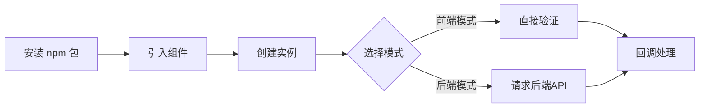
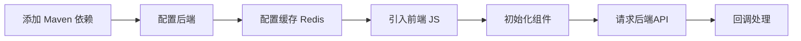
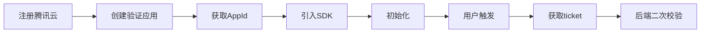

# Captcha-Pro vs AJ-Captcha vs 腾讯验证码 对比分析

## 项目概述

| 特性 | Captcha-Pro v1.0 | AJ-Captcha | 腾讯验证码 (TCaptcha) |
|------|------------------|------------|----------------------|
| **项目类型** | 前端库 + 可选后端服务 | 后端 + 前端全栈方案 | 云服务 SaaS |
| **主要语言** | TypeScript (前端) + Node.js (后端) | Java (后端) + JavaScript (前端) | 托管服务 |
| **仓库地址** | [GitHub: saqqdy/captcha-pro](https://github.com/saqqdy/captcha-pro) | [Gitee: anji-plus/captcha](https://gitee.com/anji-plus/captcha) | [腾讯云控制台](https://console.cloud.tencent.com/captcha) |
| **开源协议** | MIT | MIT | 商业服务 |
| **收费模式** | 免费 | 免费 | 免费额度 + 按量付费 |
| **适用场景** | 前端验证、轻量级验证码、可选后端验证 | 企业级后端验证、安全敏感场景 | 大流量、高安全要求场景 |

### Captcha-Pro 组件

Captcha-Pro v1.0 包含两个独立的包：

| 包名 | 描述 | 用途 |
|------|------|------|
| `captcha-pro` | 前端库 | 前端验证、后端验证前端组件 |
| `@captcha-pro/server` | Node.js 后端服务 | 服务端图片生成、验证 |

---

## 一、使用方式对比

### 1.1 使用方式区别总览

| 维度 | Captcha-Pro | AJ-Captcha | 腾讯验证码 |
|------|-------------|------------|-----------|
| **初始化方式** | `new SliderCaptcha({ el: '#id' })` | `jigsaw.init({ element: '#id' })` | `new TencentCaptcha(appId, callback)` |
| **是否需要后端** | ❌ 可选 | ✅ 必须 | ✅ 必须（云端） |
| **是否需要注册** | ❌ 不需要 | ❌ 不需要 | ✅ 需要腾讯云账号 |
| **验证触发** | 自动（滑动完成） | 自动（滑动完成） | 手动调用 `show()` |
| **结果获取** | `onSuccess` 回调 + `getData()` | 回调函数 | 回调函数 + ticket |
| **是否支持弹窗** | ✅ PopupCaptcha | ✅ popup/fixed | ✅ 弹窗模式 |
| **自定义图片** | ✅ 支持 | ✅ 支持 | ❌ 不支持 |
| **离线可用** | ✅ 支持（前端模式） | ❌ 不支持 | ❌ 不支持 |

### 1.2 核心使用流程对比

#### Captcha-Pro 使用流程



**特点：两步即可使用，零配置**

```javascript
// 步骤1: 安装
npm install captcha-pro

// 步骤2: 使用 (前端模式 - 无需后端)
import { SliderCaptcha } from 'captcha-pro'
new SliderCaptcha({ el: '#captcha', onSuccess: () => {} })
```

#### AJ-Captcha 使用流程



**特点：需要完整的后端部署和配置**

```javascript
// 步骤1: Maven依赖
<dependency>
  <groupId>com.anji-plus</groupId>
  <artifactId>spring-boot-starter-captcha</artifactId>
</dependency>

// 步骤2: 配置application.yml
aj.captcha.type=blockPuzzle
aj.captcha.cache-type=redis

// 步骤3: 配置Redis
spring.redis.host=localhost

// 步骤4: 前端初始化
jigsaw.init({
  element: '#captcha',
  request: {
    getCaptcha: '/captcha/get',
    checkCaptcha: '/captcha/check'
  }
})
```

#### 腾讯验证码使用流程



**特点：需要注册账号，获取AppId**

```javascript
// 步骤1: 引入SDK
<script src="https://ssl.captcha.qq.com/TCaptcha.js"></script>

// 步骤2: 初始化 (需要AppId)
const captcha = new TencentCaptcha('AppId', (res) => {
  if (res.ret === 0) {
    // 步骤3: 发送ticket到后端二次校验
    verifyOnServer(res.ticket, res.randstr)
  }
})

// 步骤4: 显示验证码
captcha.show()
```

### 1.3 API 调用对比

| 操作 | Captcha-Pro | AJ-Captcha | 腾讯验证码 |
|------|-------------|------------|-----------|
| **获取验证码** | 自动生成（前端）或 `GET /api/captcha` | `GET /captcha/get` | 自动（云端） |
| **验证请求** | 自动触发或 `POST /api/captcha/verify` | `POST /captcha/check` | 自动 + 二次校验 |
| **刷新验证码** | `.refresh()` 或点击刷新按钮 | 点击刷新按钮 | 点击刷新按钮 |
| **获取结果** | `getData()` / `getSignedData()` | 回调参数 | `res.ticket` + `res.randstr` |
| **重置状态** | `.reset()` | 自动重置 | 自动重置 |
| **销毁实例** | `.destroy()` | - | - |
| **获取统计** | `.getStatistics()` | ❌ 不支持 | 控制台查看 |

### 1.4 验证结果对比

| 项目 | Captcha-Pro | AJ-Captcha | 腾讯验证码 |
|------|-------------|------------|-----------|
| **验证数据** | `{ type, target, timestamp, signature }` | `{ captchaVerification }` | `{ ticket, randstr }` |
| **数据签名** | ✅ HMAC-SHA256 | ✅ AES加密 | ✅ 云端签名 |
| **时间戳验证** | ✅ 支持 | ✅ 支持 | ✅ 支持 |
| **防重放** | ✅ nonce + timestamp | ✅ 支持 | ✅ 支持 |
| **后端二次验证** | ✅ 可选 | ✅ 必须 | ✅ 必须 |

---

## 二、功能对比

### 2.1 验证码类型

| 验证码类型 | Captcha-Pro v1.0 | AJ-Captcha | 腾讯验证码 |
|-----------|------------------|------------|-----------|
| 滑动拼图 | ✅ 支持 | ✅ 支持 | ✅ 支持 |
| 点选文字 | ✅ 支持 (含迷惑文字) | ✅ 支持 | ✅ 支持 |
| 智能无感 | ✅ 支持 | ❌ 不支持 | ✅ 支持 |
| 图标点选 | ❌ 不支持 | ❌ 不支持 | ✅ 支持 |
| 空间推理 | ❌ 不支持 | ❌ 不支持 | ✅ 支持 |

### 2.2 核心功能

| 功能 | Captcha-Pro v1.0 | AJ-Captcha | 腾讯验证码 |
|------|------------------|------------|-----------|
| **前端验证** | ✅ 内置 | ❌ 不支持（需后端） | ❌ 不支持 |
| **后端验证** | ✅ 可选支持 | ✅ 内置 | ✅ 云端托管 |
| **后端服务** | ✅ Express 5 (Node.js) | ✅ Spring Boot (Java) | ✅ 云端托管 |
| **服务端图片生成** | ✅ Canvas (Node.js) | ✅ Java AWT | ✅ 云端生成 |
| **验证数据签名** | ✅ HMAC-SHA256 | ✅ 支持 | ✅ 支持 |
| **时间戳验证** | ✅ 支持 | ✅ 支持 | ✅ 支持 |
| **自定义图片** | ✅ 支持 | ✅ 支持 | ❌ 不支持 |
| **自动生成图片** | ✅ Canvas 绘制 | ✅ 后端生成 | ✅ 云端生成 |
| **刷新功能** | ✅ 内置 | ✅ 内置 | ✅ 内置 |
| **触摸支持** | ✅ 支持 | ✅ 支持 | ✅ 支持 |
| **验证精度配置** | ✅ 支持 | ✅ 支持 | ❌ 固定精度 |
| **数据统计 API** | ✅ 内置统计 | ❌ 不支持 | ✅ 控制台看板 |
| **内存缓存** | ✅ 支持 (后端) | ✅ 支持 (Redis/本地) | ✅ 云端缓存 |
| **自动过期** | ✅ 支持 (后端) | ✅ 支持 | ✅ 支持 |
| **限流防护** | ✅ 支持 (后端内置) | ✅ 支持 | ✅ 云端防护 |
| **防暴力破解** | ✅ 支持 (后端内置) | ✅ 支持 | ✅ AI 风控 |
| **二次验证** | ✅ 支持 | ✅ 支持 | ✅ 必须 |

### 2.3 UI/UX 体验对比

| UI/UX 特性 | Captcha-Pro v1.0 | AJ-Captcha | 腾讯验证码 |
|------------|------------------|------------|-----------|
| **UI 风格** | ✅ 腾讯风格 | 传统风格 | 腾讯原生 |
| **滑块进度条** | ✅ 带边框、颜色同步 | 简单进度条 | 无进度条 |
| **验证状态覆盖** | ✅ AJ-Captcha风格浮层 | 文字提示 | 覆盖层 |
| **状态颜色同步** | ✅ 滑块+进度+覆盖层 | 部分同步 | 完全同步 |
| **失败抖动动画** | ✅ 内置 | ❌ 不支持 | ✅ 支持 |
| **失败自动刷新** | ✅ 内置 | ⚠️ 需手动 | ✅ 自动 |
| **点击标记样式** | ✅ 蓝色圆形+序号 | 简单标记 | 腾讯样式 |
| **刷新按钮** | ✅ 悬浮右上角 | 内置按钮 | 悬浮按钮 |
| **移动端适配** | ✅ 完整触摸支持 | ✅ 支持 | ✅ 完美适配 |
| **无障碍支持** | ✅ 完整支持 (ARIA/键盘) | ⚠️ 基础支持 | ✅ 完整支持 |
| **键盘导航** | ✅ 完整支持 (方向键/Enter) | ❌ 不支持 | ✅ 支持 |
| **随机滑块形状** | ✅ 方形/三角/梯形/五边形 | ❌ 固定形状 | ❌ 固定形状 |
| **迷惑坑位** | ✅ 随机旋转 | ❌ 不支持 | ❌ 不支持 |
| **点选迷惑文字** | ✅ 1-2个随机字符 | ❌ 不支持 | ❌ 不支持 |
| **提示文字图片化** | ✅ Base64图片防机器识别 | ❌ 不支持 | ❌ 不支持 |
| **增强背景生成** | ✅ 渐变+装饰图案 | 简单背景 | 云端生成 |
| **中文词汇支持** | ✅ 200+常用词汇 | ❌ 字母数字 | ✅ 支持 |

### 2.4 输出产物

| 产物 | Captcha-Pro | AJ-Captcha | 腾讯验证码 |
|------|-------------|------------|-----------|
| **前端包** |
| ESM 模块 | ✅ `index.mjs` | ❌ | ❌ |
| CommonJS | ✅ `index.cjs` | ❌ | ❌ |
| IIFE (浏览器) | ✅ `index.global.js` | ✅ 前端 JS | ✅ SDK |
| TypeScript 类型 | ✅ 内置 `.d.ts` | ❌ | ❌ |
| **后端包** |
| Node.js 服务 | ✅ `@captcha-pro/server` | ❌ | ❌ |
| Java JAR | ❌ | ✅ Spring Boot Starter | ❌ |
| 云服务 | ❌ | ❌ | ✅ 托管服务 |

---

## 三、安全性对比

| 安全特性 | Captcha-Pro v1.0 | AJ-Captcha | 腾讯验证码 |
|---------|------------------|------------|-----------|
| **验证位置** | 前端 + 后端可选 | 后端验证 | 云端验证 |
| **服务端图片生成** | ✅ 支持 (@captcha-pro/server) | ✅ 支持 | ✅ 支持 |
| **验证码防篡改** | ✅ 签名验证 | ✅ 支持 (服务端生成) | ✅ 支持 |
| **数据签名** | ✅ HMAC-SHA256 | ✅ 支持 | ✅ 支持 |
| **时间戳验证** | ✅ 支持 | ✅ 支持 | ✅ 支持 |
| **验证码缓存** | ✅ 内存缓存 (后端) | ✅ Redis/本地 | ✅ 云端 |
| **自动过期** | ✅ 支持 (后端 60s 默认) | ✅ 支持 | ✅ 支持 |
| **请求限流** | ✅ 支持 (后端内置) | ✅ 支持 | ✅ 云端智能限流 |
| **IP 黑名单** | ✅ 支持 (后端内置) | ✅ 支持 | ✅ 云端管理 |
| **防暴力破解** | ✅ 支持 (后端内置) | ✅ 支持 | ✅ AI 风控 |
| **防机器人识别** | ✅ 迷惑坑位+迷惑文字 | ❌ 不支持 | ✅ AI 风控 |
| **管理 API** | ✅ 黑名单管理接口 | ⚠️ 需配置 | ✅ 控制台 |
| **二次验证** | ✅ 支持 | ✅ 支持 | ✅ 必须 |
| **AI 风控** | ⚠️ 基础行为分析 | ❌ 不支持 | ✅ 深度学习模型 |
| **设备指纹** | ✅ 基础指纹 | ❌ 不支持 | ✅ 支持 |
| **行为分析** | ✅ 轨迹分析 | ❌ 不支持 | ✅ 支持 |

### 安全特性详情

#### Captcha-Pro 安全配置

```javascript
// 环境变量配置
PORT=3001
HOST=localhost
SECRET_KEY=your-secret-key
EXPIRE_TIME=60000
TIMESTAMP_TOLERANCE=60000
```

```bash
# API 端点
GET  /api/security/status/:ip   # 获取 IP 安全状态
GET  /api/security/blacklist    # 获取黑名单列表
POST /api/security/blacklist    # 添加 IP 到黑名单
DELETE /api/security/blacklist/:ip  # 移除 IP 黑名单
```

#### 安全配置参数

| 参数 | 默认值 | 说明 |
|------|--------|------|
| `rateLimitMax` | 60 | 每分钟最大请求数 |
| `rateLimitWindow` | 60000 | 限流窗口 (ms) |
| `rateLimitBlockDuration` | 300000 | 限流封锁时长 (ms) |
| `maxFailedAttempts` | 10 | 最大失败尝试次数 |
| `failedAttemptsWindow` | 300000 | 失败尝试窗口 (ms) |
| `bruteForceBlockDuration` | 900000 | 暴力破解封锁时长 (ms) |

> **重要提示**：
> - Captcha-Pro v1.0 支持前端验证和后端验证两种模式
> - 使用 `@captcha-pro/server` 后端服务可实现服务端图片生成，安全性更高
> - 后端服务内置请求限流、IP黑名单、防暴力破解功能
> - 启用 `security.enableSign` 可防止数据篡改
> - 腾讯验证码安全性最高，但依赖第三方服务

---

## 四、性能对比

| 指标 | Captcha-Pro | AJ-Captcha | 腾讯验证码 |
|------|-------------|------------|-----------|
| **前端包体积** | ~34KB (min) | ~50KB+ | ~30KB SDK |
| **首次加载 (前端模式)** | 快 (无网络请求) | - | - |
| **首次加载 (后端模式)** | 中等 (需请求后端) | 慢 (需请求后端) | 中等 (CDN 加速) |
| **刷新速度 (前端模式)** | 快 (本地生成) | - | - |
| **刷新速度 (后端模式)** | 中等 (需请求后端) | 中等 (需请求后端) | 快 (CDN 缓存) |
| **验证速度** | 快 (本地/后端可选) | 中等 (需请求后端) | 快 (云端分布式) |
| **后端资源占用** | 低 (Node.js) | 中 (Java + Redis) | 无 |
| **并发处理能力** | 无限制 (前端模式) | 受后端性能限制 | 高 (云端弹性扩展) |
| **后端启动时间** | ~1s (Node.js) | ~10s (Spring Boot) | - |

---

## 五、选型建议

### 选择 Captcha-Pro 的场景：

1. **快速原型开发** - 无需搭建后端，开箱即用
2. **静态站点** - 无后端服务器的网站 (前端模式)
3. **灵活验证模式** - 需要前端验证或后端验证可选
4. **轻量级需求** - 对包体积敏感的项目
5. **学习/教学项目** - 理解验证码原理
6. **框架独立需求** - 需要在多种框架中使用
7. **完全自主可控** - 不想依赖第三方服务
8. **需要统计功能** - 内置验证统计 API
9. **Node.js 技术栈** - 使用 @captcha-pro/server 后端服务
10. **中小型项目** - 前端验证 + 可选后端增强安全性

### 选择 AJ-Captcha 的场景：

1. **企业级应用** - 需要高安全性保障
2. **用户系统** - 登录、注册、密码找回等
3. **防刷单场景** - 电商秒杀、投票等
4. **私有化部署** - 数据不能出内网
5. **合规要求** - 需要通过安全审计
6. **分布式架构** - 多节点部署
7. **成本敏感** - 长期大流量但不想付费

### 选择腾讯验证码的场景：

1. **大流量业务** - 日均验证量超过 10 万次
2. **高安全要求** - 金融、支付、电商等
3. **智能风控** - 需要对抗黑产攻击
4. **无运维团队** - 不想自建验证服务
5. **全球化业务** - 需要全球节点加速
6. **合规需求** - 需要专业安全认证
7. **快速上线** - 无需开发后端验证逻辑

---

## 六、总结

| 维度 | Captcha-Pro v1.0 | AJ-Captcha | 腾讯验证码 |
|------|------------------|------------|-----------|
| **易用性** | ⭐⭐⭐⭐⭐ | ⭐⭐⭐ | ⭐⭐⭐⭐ |
| **安全性** | ⭐⭐⭐⭐ | ⭐⭐⭐⭐⭐ | ⭐⭐⭐⭐⭐ |
| **功能丰富度** | ⭐⭐⭐⭐ | ⭐⭐⭐⭐ | ⭐⭐⭐⭐⭐ |
| **UI/UX 体验** | ⭐⭐⭐⭐⭐ | ⭐⭐⭐ | ⭐⭐⭐⭐⭐ |
| **轻量级** | ⭐⭐⭐⭐⭐ | ⭐⭐ | ⭐⭐⭐ |
| **灵活性** | ⭐⭐⭐⭐⭐ | ⭐⭐⭐⭐ | ⭐⭐⭐ |
| **企业级支持** | ⭐⭐⭐ | ⭐⭐⭐⭐ | ⭐⭐⭐⭐⭐ |
| **开发效率** | ⭐⭐⭐⭐⭐ | ⭐⭐⭐ | ⭐⭐⭐⭐ |
| **成本** | ⭐⭐⭐⭐⭐ | ⭐⭐⭐⭐ | ⭐⭐⭐ |
| **数据可控** | ⭐⭐⭐⭐⭐ | ⭐⭐⭐⭐⭐ | ⭐⭐ |

### 最终建议

| 场景 | 推荐方案 |
|------|---------|
| 个人项目/小型网站 | Captcha-Pro (前端模式) |
| 企业内部系统 | AJ-Captcha 或 Captcha-Pro (后端模式) |
| 中型企业官网 | Captcha-Pro (后端模式) 或 AJ-Captcha |
| Node.js 技术栈项目 | Captcha-Pro (后端模式) |
| Java/Spring 技术栈 | AJ-Captcha |
| 大型互联网应用 | 腾讯验证码 |
| 金融/支付系统 | 腾讯验证码 |
| 政务/医疗系统 | AJ-Captcha (私有化) 或 Captcha-Pro (后端模式) |
| 开源项目 | Captcha-Pro 或 AJ-Captcha |
| 静态站点/无后端 | Captcha-Pro (前端模式) |

### 结论

三者各有优势，选择应根据：
- **安全要求**：腾讯验证码 ≈ AJ-Captcha ≈ Captcha-Pro (后端模式) > Captcha-Pro (前端模式)
- **成本敏感**：Captcha-Pro = AJ-Captcha > 腾讯验证码
- **开发效率**：Captcha-Pro > 腾讯验证码 > AJ-Captcha
- **功能丰富**：腾讯验证码 > Captcha-Pro ≈ AJ-Captcha
- **灵活性**：Captcha-Pro > AJ-Captcha > 腾讯验证码
- **UI/UX 体验**：腾讯验证码 ≈ Captcha-Pro > AJ-Captcha
- **技术栈匹配**：Captcha-Pro (Node.js/TypeScript) vs AJ-Captcha (Java/Spring)

开发者应根据项目实际需求、团队技术栈、安全等级和预算进行综合评估。

---

## 参考链接

- [Captcha-Pro - GitHub](https://github.com/saqqdy/captcha-pro)
- [AJ-Captcha - Gitee](https://gitee.com/anji-plus/captcha)
- [AJ-Captcha - GitHub](https://github.com/anji-plus/captcha)
- [腾讯验证码 - 官方文档](https://cloud.tencent.com/document/product/1110)
- [腾讯验证码 - 控制台](https://console.cloud.tencent.com/captcha)
